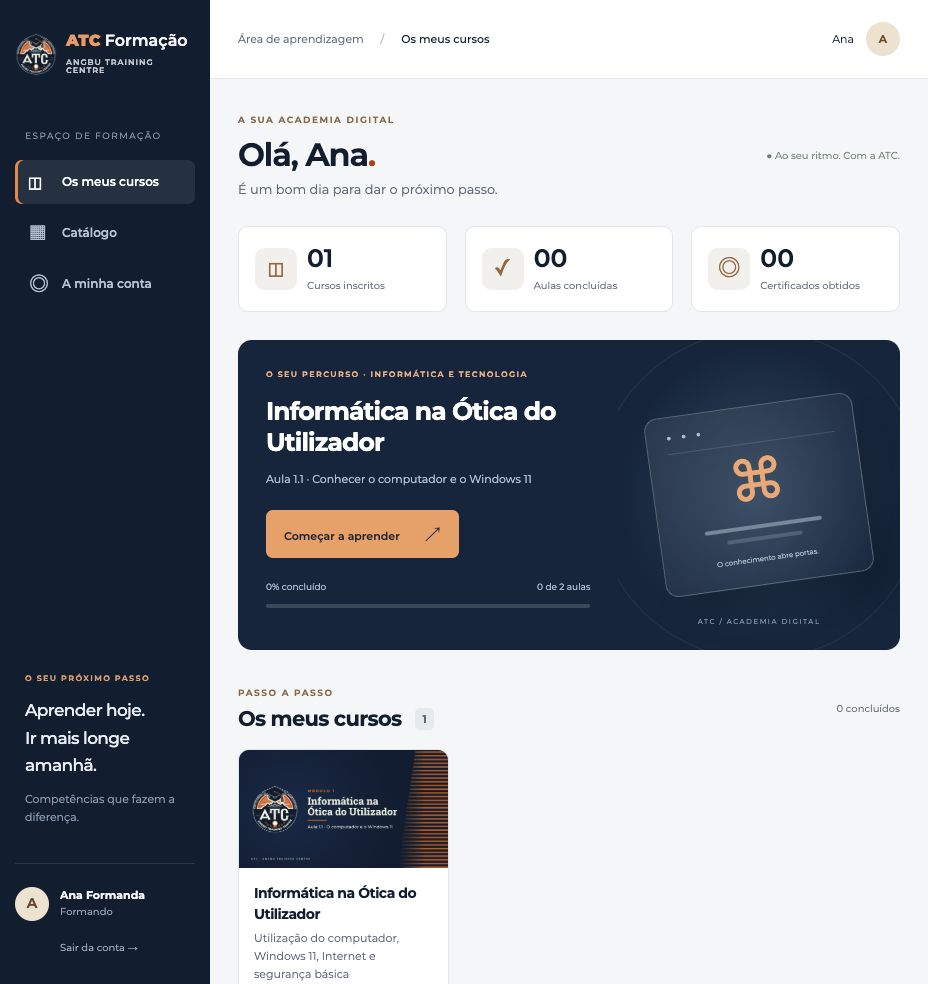
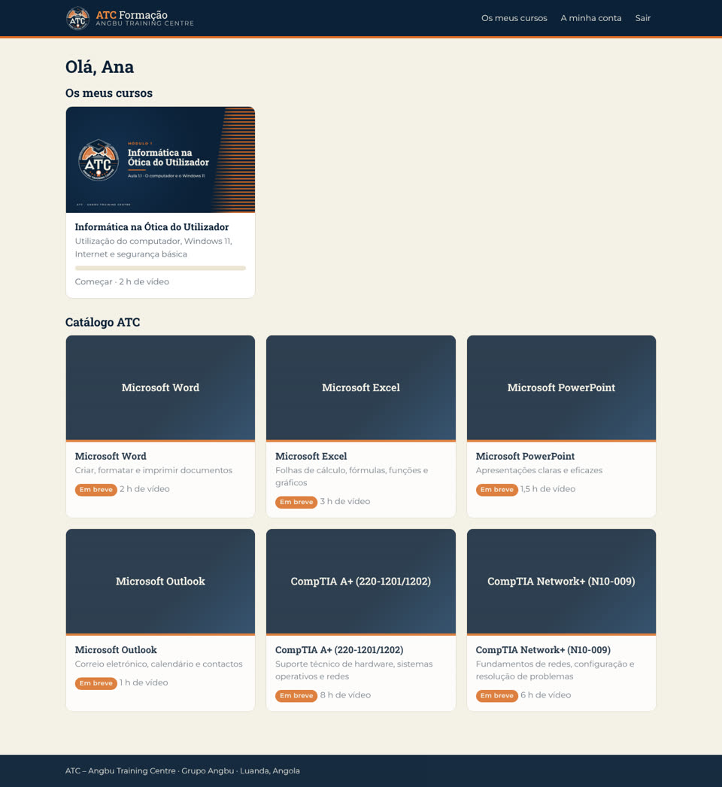
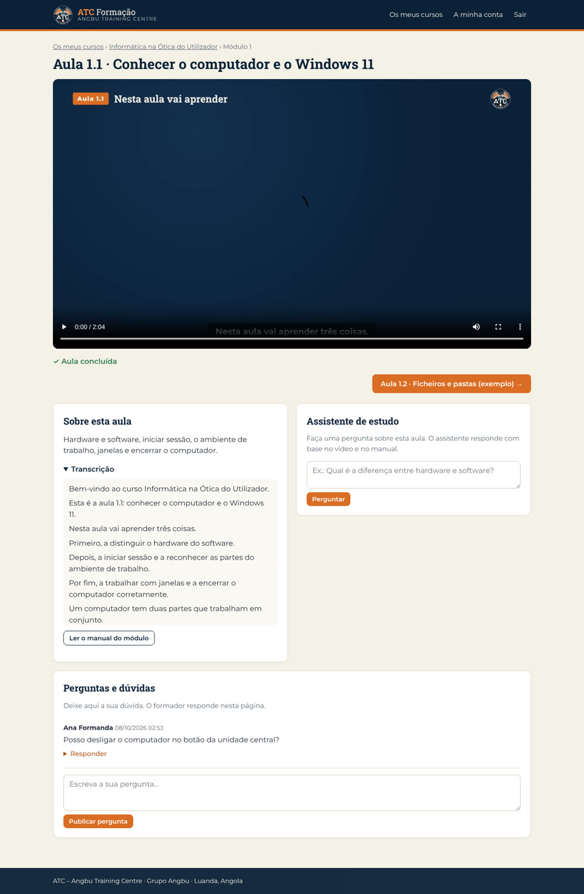

# Perfis e apresentadores ATC

Esta versão inclui personalização de perfil, escolha da Helena ou do Miguel por curso, retratos originais, guiões PT-PT e suporte para os futuros vídeos por apresentador. Ver [pacote de produção](producao/LEIA-ME.md) e [guiões](producao/guiões/GUIOES_ATC_PT-PT.md).

Para produzir os clips com Gemini Omni Flash, use [GUIOES_ATC_GEMINI_OMNI_FLASH.md](producao/guiões/GUIOES_ATC_GEMINI_OMNI_FLASH.md). Cada cena é uma chamada independente de 7–9 segundos e nunca ultrapassa 10 segundos; os planos de cada cena já estão descritos no mesmo bloco.

Para criar as duas vozes personalizadas em português angolano, use [PROMPTS_VOZES_ANGOLA_PT-PT.md](producao/vozes/PROMPTS_VOZES_ANGOLA_PT-PT.md). O ficheiro inclui uma voz feminina para Helena, uma voz masculina para Miguel, texto de teste e critérios de aprovação.

As demonstrações em vídeo e o manual Word continuam a ser os originais. O manual online inclui agora referências visuais reais e identifica as ilustrações remanescentes.

---

# ATC LMS — Premium update

The updated interface adds a responsive navigation sidebar, personalised learner dashboard, real progress metrics, a direct next-lesson action, searchable course catalogue, distinct course covers, and a redesigned sign-in page. Fonts and visual assets work offline.

Run `python3 atc_lms.py` from this folder, then open http://localhost:8080. Existing course, quiz, certificate, and management workflows remain available.

Validation for this update: Python compilation; HTTP smoke checks for learner, trainer and administrator pages; learner management access denied; browser checks for login, course search (including no results), next-lesson navigation, and 390 px dashboard/lesson layouts. Video completion and certificate issuance were not re-tested end to end in this visual update.



---

# ATC LMS

A working online-learning platform for ATC (Angbu Training Centre), branded and in PT-PT, with the pilot course **Informática na Ótica do Utilizador, Módulo 1** already loaded from the demo pack: both lesson videos with subtitles, the online manual plus the Word download, and the 8-question quiz.



## Run it (2 minutes)

You only need **Python 3.10 or newer**. Nothing else is installed: no pip packages, no database server, and no internet connection.

- **Windows:** double-click `iniciar.bat`.
- **macOS / Linux:** `./iniciar.sh` (or `python3 atc_lms.py`).

Then open **http://localhost:8080**. Other computers in the same room or Wi-Fi can use the "rede local" address printed in the window, which suits classroom sessions with no internet.

Demo accounts, created on the first run:

| Role | Email | Password |
|---|---|---|
| Formando (learner) | formando@atc.ao | formando123 |
| Formador (trainer) | formador@atc.ao | formador123 |
| Administrador | admin@atc.ao | admin123 |

Before real learners use it, change these passwords and turn off the demo notice under **Gestão**.

## What it does

**Learners**
- Can open "Os meus cursos" plus the ATC catalogue. The other six courses appear as "Em breve".
- Get a video player with PT subtitles and a transcript. It resumes where they stopped. A lesson only counts as seen once 90% of it has actually played, so skipping to the end does not count.
- Can read the module manual online, with figures, tips and the exercise (good on a phone), or download it as Word.
- Take a quiz per module. Options are shuffled, the learner gets instant correction, the pass mark is 70%, and retries are unlimited.
- Can post questions under each lesson, and the trainer answers on the same page.
- Get a **certificate** once every lesson and quiz is done. It is printable or can be saved as A4 PDF, and anyone can check it at `/verificar`.
- Get a **study assistant** (optional) that answers from the lesson transcript and manual using your local Ollama model (see below).

**Trainers and admins (Gestão)**
- See an overview of active learners, certificates issued and unanswered questions.
- Can create learners one at a time, or paste many at once from Excel as `nome;email;palavra-passe;curso`.
- Can enrol learners in or remove them from courses, reset passwords and deactivate accounts.
- Get a **class report** per course showing progress, lessons seen, quiz scores, certificate and last access, with CSV export for Excel.
- Admins only: re-import courses after adding content. Learner progress is kept.



## Adding lessons and courses

Each course is a folder in `cursos/` with a `curso.json`. The pilot is `cursos/informatica/`, so copy its pattern (the `//` comments are explanation only, leave them out of the real file):

```jsonc
{
  "slug": "word", "title": "Microsoft Word", "subtitle": "…", "description": "…",
  "status": "publicado",            // or "em_breve"
  "order": 2, "hours_video": 2, "hours_class": 15, "cover": "capa.jpg",
  "modules": [{
    "num": 1, "title": "…", "intro": "…",
    "manual_json": "manual/modulo-1.json",        // same JSON the manual pipeline uses
    "manual_docx": "manual/Manual_Word_M1.docx",
    "manual_figures": "manual/figures",
    "lessons": [{ "slug": "aula-1-1", "title": "Aula 1.1 · …", "video": "video/aula-1-1.mp4",
                  "subtitles": "video/aula-1-1.srt", "subtitles_on": false, "poster": "video/aula-1-1.jpg",
                  "summary": "…" }],
    "quiz": { "title": "Questionário do Módulo 1", "gift": "quiz/modulo-1.gift.txt", "pass_mark": 70 }
  }]
}
```

The pipeline in `atc-producao/` outputs fit this format directly:

| Field | Pipeline output it takes |
|---|---|
| `video` | The lesson MP4 |
| `subtitles` | The `.srt` or `.vtt` file. SRT is converted automatically. |
| `manual_json` | The manual-module JSON |
| `quiz.gift` | The Moodle GIFT file from `make_quiz.py`. Multiple choice and true/false are supported. |

Set `subtitles_on` to `false` when the subtitles are already burned into the video, as in Aula 1.1.

After changing files, go to **Gestão > Cursos > Importar** or run `python atc_lms.py importar`. Lessons are matched by `slug`, so renaming a slug resets progress for that lesson.

## Study assistant with a local model (optional)

If Ollama is running on the same machine, a "Assistente de estudo" box appears on every lesson. It answers in PT-PT, grounded only in that lesson's transcript and manual, and refers the learner to the trainer when the answer isn't there.

```bash
ollama pull qwen2.5:7b          # default model
ATC_MODELO=gemma3:12b python atc_lms.py   # to use another one
```

Without Ollama, the box is simply hidden. Note: I tested this against a stand-in server that speaks the Ollama API, not a real model.

## Putting it online for ATC

Run it on any small Linux VPS (1 vCPU / 1 GB is plenty for a few hundred learners) behind Caddy for HTTPS:

```bash
# /etc/systemd/system/atc-lms.service  → ExecStart=/usr/bin/python3 /opt/atc-lms/atc_lms.py --porta 8080 --host 127.0.0.1
# Caddyfile:
formacao.grupoangbu.com {
    reverse_proxy 127.0.0.1:8080
}
```

**Backups:** copy the `dados/` folder (one SQLite file) and `cursos/`.

**Settings** are environment variables:

| Variable | What it sets |
|---|---|
| `ATC_PORTA` | Port |
| `ATC_HOST` | Address to listen on |
| `ATC_CURSOS` | Courses folder |
| `ATC_DADOS` | Data folder |
| `ATC_OLLAMA_URL` | Ollama address |
| `ATC_MODELO` | Model the assistant uses |
| `ATC_LOG=1` | Logs every request |

## Why not stock Moodle

The proposal promises ATC an LMS with no licence fees, and Moodle would meet that. It was still the wrong first step here:

- It needs PHP, a web server, MySQL/PostgreSQL, a cron job and regular upgrades, which a small training company without IT staff has to maintain.
- It is heavy on cheap hosting and slow over Angolan mobile data.
- Getting it to look like ATC means theme work.

This LMS runs from a single Python file on a trainer's laptop, a classroom PC or a $5 VPS, offline if needed, and is ATC-branded out of the box.

Moving to Moodle later stays easy:

- The quizzes are already in Moodle's GIFT format.
- Videos, subtitles and the Word manuals are plain files.
- Learner results export to CSV.

What Moodle has that this does not:

- SCORM packages
- A mobile app
- Email notifications and self-service password reset (here the trainer resets passwords in Gestão)
- Forums beyond the per-lesson questions
- Grade books with weighting
- A large plugin ecosystem

If ATC later needs those, switch.

## Tested

The test was an end-to-end browser run against this folder:

- Wrong login is refused.
- Skipping to the end of a video does not mark it seen. Watching it does.
- Subtitles load (33 cues).
- The manual renders with all 6 figures.
- A quiz attempt at 0% fails. One at 100% passes.
- A certificate is issued, and the public verification page confirms it.
- Learners are blocked from Gestão and from courses they aren't enrolled in.
- Posts without the CSRF token are refused.
- Video range requests (seeking) work, and path traversal is refused.
- A trainer answers a learner question.
- A bulk import of 2 learners succeeds and rejects a bad line.
- The CSV report is correct.
- Re-importing courses keeps progress.
- The phone layout has no sideways scrolling.

The test ran on Python 3.10 and 3.13.

The test browser can't play H.264, so it used WebM copies of the two videos. The MP4s shipped here play in Chrome, Edge, Firefox and Safari.

## Files

```
atc_lms.py      the whole app (server, database, pages)
static/         CSS, player script, logo, fonts
cursos/         course folders (informatica = pilot; others are "em breve" placeholders)
dados/          created on first run: atc.db (users, progress, results); back this up
capturas/       screenshots
iniciar.bat / iniciar.sh
```
